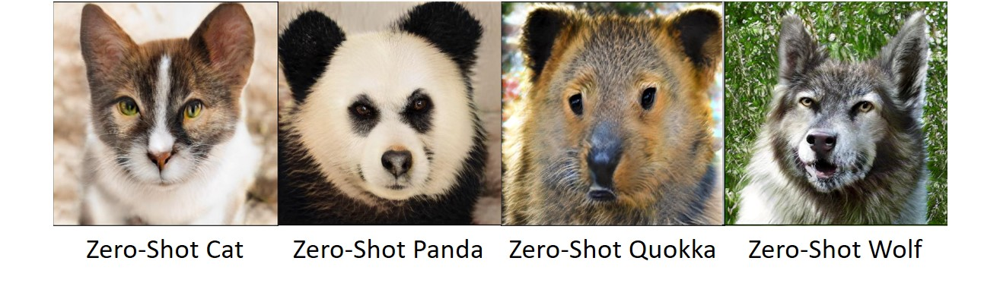
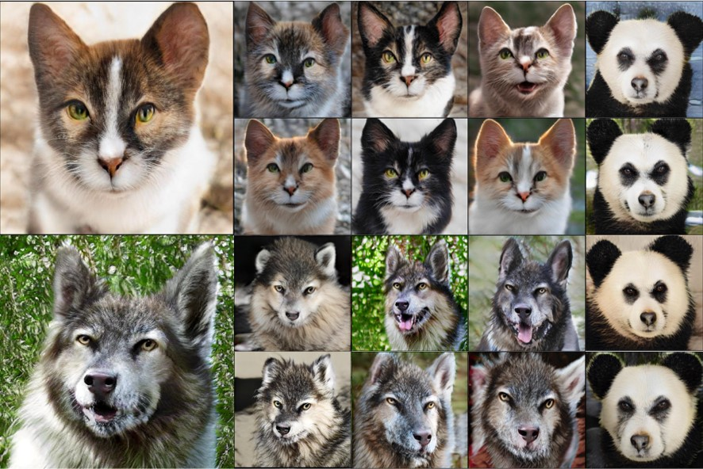

# StyleGAN-NADA

# Zero-Shot non-adversarial domain adaptation of pre-trained generators.

[](http://colab.research.google.com/github/rinongal/stylegan-nada/blob/main/stylegan_nada.ipynb)

This repo contains pre-release code for a zero-shot domain translation method for generators.
At a high level, our method works using two paired generators. We initialize both using a pre-trained model (for example, FFHQ). We hold one generator constant and train the other by demanding that the direction between their generated images in clip space aligns with some given textual direction.

The following diagram illustrates the process:


We set up a colab notebook so you can play with it yourself :) Let us know if you come up with any cool results!

We've also included inversion in the notebook (using [ReStyle](https://github.com/yuval-alaluf/restyle-encoder)) so you can use the paired generators to edit real images.
Most edits will work well with the [pSp](https://github.com/eladrich/pixel2style2pixel) version of ReStyle, which also allows for more accurate reconstructions.
In some cases, you may need to switch to the [e4e](https://github.com/omertov/encoder4editing) based encoder for better editing at the cost of reconstruction accuracy.

### Domain change examples

Here's our collection of changed celebs and animals. The text below each column denotes the source and target descriptions.


### Animal Domains

These samples were synthesized from generators converted to the appropriate domain without any training images:



<p align="center">
 
</p>

### Setup

The code relies on the official implementation of [CLIP](https://github.com/openai/CLIP), 
and the [Rosinality](https://github.com/rosinality/stylegan2-pytorch/) pytorch implementation of StyleGAN2.

#### Requirements
- Anaconda
- Pretrained StyleGAN2 generator (can be downloaded from [here](https://drive.google.com/file/d/1EM87UquaoQmk17Q8d5kYIAHqu0dkYqdT/view?usp=sharing)). You can also download a model from [here](https://github.com/NVlabs/stylegan2-ada) and convert it with the provited script. See the colab notebook for examples.

In addition, run the following commands:
  ```shell script
conda install --yes -c pytorch pytorch=1.7.1 torchvision cudatoolkit=<CUDA_VERSION>
pip install ftfy regex tqdm
pip install git+https://github.com/openai/CLIP.git
```

### Usage

To convert a generator from one domain to another, use the colab notebook or run:

```
python3 train.py --size 1024 
                 --batch 2 
                 --n_sample 4 
                 --output_dir /path/to/output/dir
                 --warmup 0 
                 --lambda_cycle 0.0 
                 --lr 0.002 
                 --frozen_gen_ckpt /path/to/stylegan2-ffhq-config-f.pt 
                 --iter 301 
                 --source_class "photo" 
                 --target_class "sketch" 
                 --lambda_direction 1.0 
                 --lambda_patch 0.0 
                 --lambda_global 0.0
```

Where you should adjust size to match the size of the pre-trained model, and the source_class and target_class descriptions control the direction of change.
For most modifications these default parameters should be good enough. See the colab notebook for more detailed directions.

## Related Works

The concept of using CLIP to guide StyleGAN generation results was introduced in [StyleCLIP](https://arxiv.org/abs/2103.17249) (Patashnik et al.).

We invert real images into the GAN's latent space using [ReStyle](https://arxiv.org/abs/2104.02699) (Alaluf et al.)
