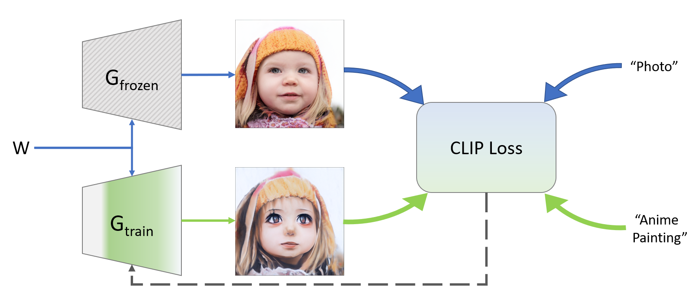
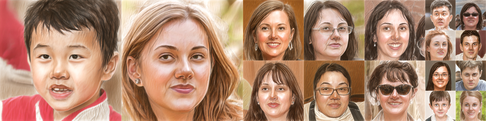
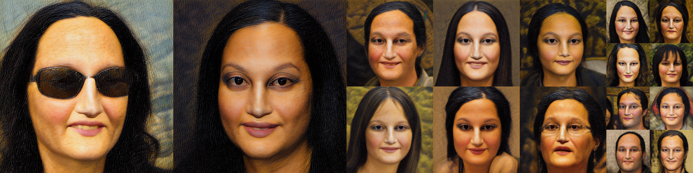
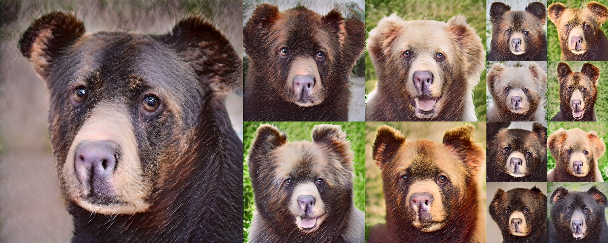
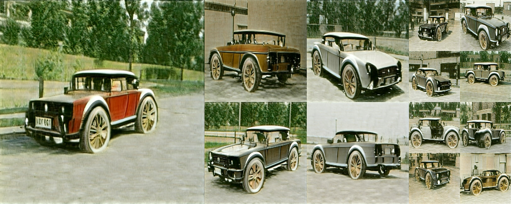
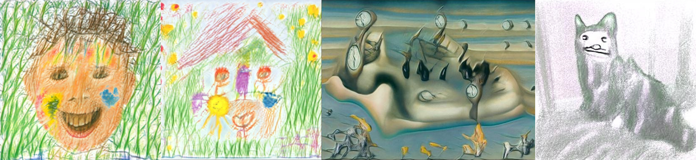
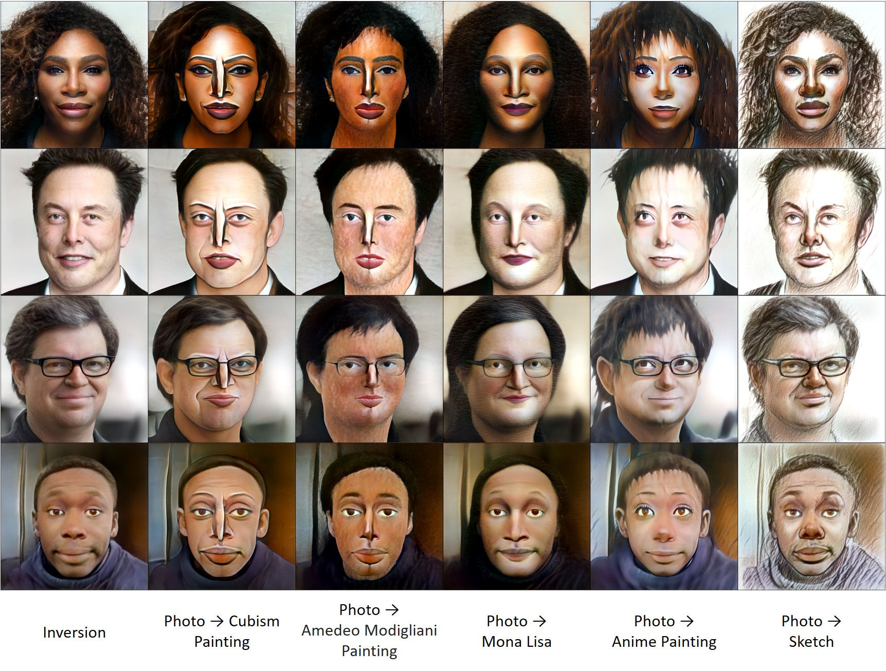
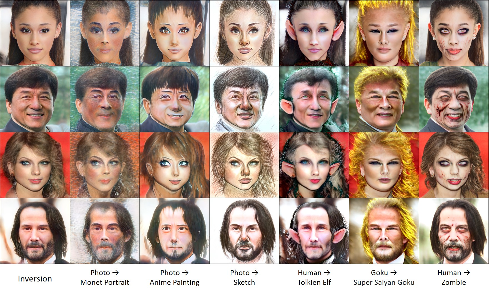
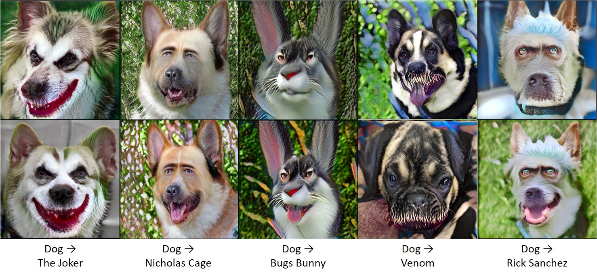

# StyleGAN-NADA: CLIP-Guided Domain Adaptation of Image Generators (SIGGRAPH 2022)

[](http://colab.research.google.com/github/rinongal/stylegan-nada/blob/main/stylegan_nada.ipynb) 
[](https://www.kaggle.com/ratthachat/stylegan-nada-playground) [](https://arxiv.org/abs/2108.00946)
[](https://www.casualganpapers.com/text-guided-clip-gan-domain-adaptation/StyleGAN-NADA-explained.html)[](https://huggingface.co/spaces/rinong/StyleGAN-NADA)

[[Project Website](https://stylegan-nada.github.io/)] [[Replicate.ai Project](https://replicate.ai/rinongal/stylegan-nada)]

> **StyleGAN-NADA: CLIP-Guided Domain Adaptation of Image Generators**<br>
> Rinon Gal, Or Patashnik, Haggai Maron, Amit H. Bermano, Gal Chechik, Daniel Cohen-Or <br>

>**Abstract**: <br>
> Can a generative model be trained to produce images from a specific domain, guided by a text prompt only, without seeing any image? In other words: can an image generator be trained blindly? Leveraging the semantic power of large scale Contrastive-Language-Image-Pre-training (CLIP) models, we present a text-driven method that allows shifting a generative model to new domains, without having to collect even a single image from those domains.
We show that through natural language prompts and a few minutes of training, our method can adapt a generator across a multitude of domains characterized by diverse styles and shapes. Notably, many of these modifications would be difficult or outright impossible to reach with existing methods.
We conduct an extensive set of experiments and comparisons across a wide range of domains. These demonstrate the effectiveness of our approach and show that our shifted models maintain the latent-space properties that make generative models appealing for downstream tasks.

## Description
This repo contains the official implementation of StyleGAN-NADA, a Non-Adversarial Domain Adaptation for image generators.
At a high level, our method works using two paired generators. We initialize both using a pre-trained model (for example, FFHQ). We hold one generator constant and train the other by demanding that the direction between their generated images in clip space aligns with some given textual direction.

The following diagram illustrates the process:



We set up a colab notebook so you can play with it yourself :) Let us know if you come up with any cool results!

We've also included inversion in the notebook (using [ReStyle](https://github.com/yuval-alaluf/restyle-encoder)) so you can use the paired generators to edit real images.
Most edits will work well with the [pSp](https://github.com/eladrich/pixel2style2pixel) version of ReStyle, which also allows for more accurate reconstructions.
In some cases, you may need to switch to the [e4e](https://github.com/omertov/encoder4editing) based encoder for better editing at the cost of reconstruction accuracy.

## Updates
**18/05/2022 (A)** Added [HuggingFace Spaces demo](https://huggingface.co/spaces/rinong/StyleGAN-NADA)  <br>
**18/05/2022 (B)** Added (partial) StyleGAN-XL support <br>
**03/10/2021 (A)** Interpolation video script now supports InterfaceGAN based-editing. <br>
**03/10/2021 (B)** Updated the notebook with support for target style images. <br>
**03/10/2021 (C)** Added [replicate.ai](https://replicate.ai/rinongal/stylegan-nada) support. You can now run inference or generate videos without needing to setup anything or work with code. <br>
**22/08/2021** Added a script for generating cross-domain interpolation videos (similar to the top video in the project page). <br>
**21/08/2021 (A)** Added the ability to mimic styles from an image set. See the usage section. <br>
**21/08/2021 (B)** Added dockerized UI tool. <br>
**21/08/2021 (C)** Added link to drive with pre-trained models.

## Generator Domain Adaptation

We provide many examples of converted generators in our [project page](https://stylegan-nada.github.io/). Here are a few samples:

<p float="centered">
  
  
  
   
</p>

## Setup

The code relies on the official implementation of [CLIP](https://github.com/openai/CLIP), 
and the [Rosinality](https://github.com/rosinality/stylegan2-pytorch/) pytorch implementation of StyleGAN2.

### Requirements
- Anaconda
- Pretrained StyleGAN2 generator (can be downloaded from [here](https://drive.google.com/file/d/1EM87UquaoQmk17Q8d5kYIAHqu0dkYqdT/view?usp=sharing)). You can also download a model from [here](https://github.com/NVlabs/stylegan2-ada) and convert it with the provited script. See the colab notebook for examples.

In addition, run the following commands:
  ```shell script
conda install --yes -c pytorch pytorch=1.7.1 torchvision cudatoolkit=<CUDA_VERSION>
pip install ftfy regex tqdm
pip install git+https://github.com/openai/CLIP.git
```

### Usage

To convert a generator from one domain to another, use the colab notebook or run the training script in the ZSSGAN directory:

```
python train.py --size 1024 
                --batch 2 
                --n_sample 4 
                --output_dir /path/to/output/dir 
                --lr 0.002 
                --frozen_gen_ckpt /path/to/stylegan2-ffhq-config-f.pt 
                --iter 301 
                --source_class "photo" 
                --target_class "sketch" 
                --auto_layer_k 18
                --auto_layer_iters 1 
                --auto_layer_batch 8 
                --output_interval 50 
                --clip_models "ViT-B/32" "ViT-B/16" 
                --clip_model_weights 1.0 1.0 
                --mixing 0.0
                --save_interval 150
```

Where you should adjust size to match the size of the pre-trained model, and the source_class and target_class descriptions control the direction of change.
For an explenation of each argument (and a few additional options), please consult ZSSGAN/options/train_options.py. For most modifications these default parameters should be good enough. See the colab notebook for more detailed directions.

**21/08/2021** Instead of using source and target texts, you can now target a style represented by a few images. Simply replace the `--source_class` and `--target_class` options with:

```
--style_img_dir /path/to/img/dir
```
where the directory should contain a few images (png, jpg or jpeg) with the style you want to mimic. There is no need to normalize or preprocess the images in any form.

Some results of converting an FFHQ model using children's drawings, LSUN Cars using Dali paintings and LSUN Cat using abstract sketches:



**18/05/2022**
StyleGAN3 / StyleGAN-XL models can be trained by appending the `--sg3` or `--sgxl` flags to the training command. Please note that StyleGAN-3 based models (and XL among them) may display grid artifacts under fine-tuning, and that neither model currently supports layer freezing.

See [](http://colab.research.google.com/github/rinongal/stylegan-nada/blob/main/stylegan3_nada.ipynb) for an example of training with SG3.

## Pre-Trained Models

We provide a [Google Drive](https://drive.google.com/drive/folders/1Z76nD8pXIL2O5f6xV8VjM4DUCmhbzn0l?usp=sharing) containing an assortment of models used in the paper, tweets and other locations.
If you want access to a model not yet included in the drive, please let us know.

## Docker

We now provide a simple dockerized interface for training models.
The UI currently supports a subset of the colab options, but does not require repeated setups.

In order to use the docker version, you must have a CUDA compatible GPU and must install [nvidia-docker](https://github.com/NVIDIA/nvidia-docker) and [docker-compose](https://docs.docker.com/compose/install/) first.

After cloning the repo, simply run:
```
cd StyleGAN-nada/
docker-compose up
```

* Downloading the docker for the first time may take a few minutes.
* While the docker is running, the UI should be available under http://localhost:8888/
* The UI was tested using an RTX3080 GPU with 16GB of RAM. Smaller GPUs may run into memory limits with large models.

If you find the UI useful and want it expended to allow easier access to saved models, support for real image editing etc., please let us know.

## Editing Video

In order to generate a cross-domain editing video (such as the one at the top of our project page), prepare a set of edited latent codes in the original domain and run the following `generate_videos.py` script in the `ZSSGAN` directory:

```
python generate_videos.py --ckpt /model_dir/pixar.pt             \
                                 /model_dir/ukiyoe.pt            \
                                 /model_dir/edvard_munch.pt      \
                                 /model_dir/botero.pt            \
                          --out_dir /output/video/               \
                          --source_latent /latents/latent000.npy \
                          --target_latents /latents/
```

* The script relies on ffmpeg to function. On linux it can be installed by running `sudo apt install ffmpeg`
* The argument to `--ckpt` is a list of model checkpoints used to fill the grid. 
  * The number of models must be a perfect square, e.g. 1, 4, 9...
* The argument to `--target_latents` can be either a directory containing a set of `.npy` w-space latent codes, or a list of individual files.
* Please see the script for more details.

We provide [example latent codes](https://drive.google.com/file/d/1E4lkAKJhZlfLeKOtKrRcqN-Te-8IotYm/view?usp=sharing) for the same identity used in our video. If you want to generate your own, we recommend using [StyleCLIP](https://github.com/orpatashnik/StyleCLIP), [InterFaceGAN](https://github.com/genforce/interfacegan), [StyleFlow](https://github.com/RameenAbdal/StyleFlow), [GANSpace](https://github.com/harskish/ganspace) or any other latent space editing method.

**03/10/2021** We now provide editing directions for use in video generation. To use the built-in directions, omit the ```--target_latents``` argument. You can use specific editing directions from the available list by passing them with the ```--edit_directions``` flag. See ```generate_videos.py``` for more information. <br>

## Related Works

The concept of using CLIP to guide StyleGAN generation results was introduced in [StyleCLIP](https://arxiv.org/abs/2103.17249) (Patashnik et al.).

We invert real images into the GAN's latent space using [ReStyle](https://arxiv.org/abs/2104.02699) (Alaluf et al.).

Editing directions for video generation were taken from [Anycost GAN](https://github.com/mit-han-lab/anycost-gan) (Lin et al.).

## Citation

If you make use of our work, please cite our paper:

```
@misc{gal2021stylegannada,
      title={StyleGAN-NADA: CLIP-Guided Domain Adaptation of Image Generators}, 
      author={Rinon Gal and Or Patashnik and Haggai Maron and Gal Chechik and Daniel Cohen-Or},
      year={2021},
      eprint={2108.00946},
      archivePrefix={arXiv},
      primaryClass={cs.CV}
}
```

## Additional Examples

Our method can be used to enable out-of-domain editing of real images, using pre-trained, off-the-shelf inversion networks. Here are a few more examples:






